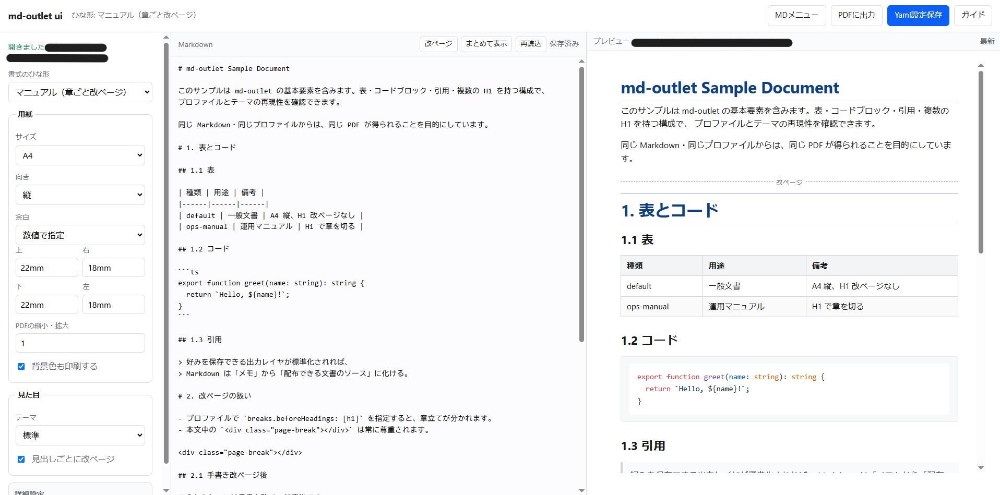
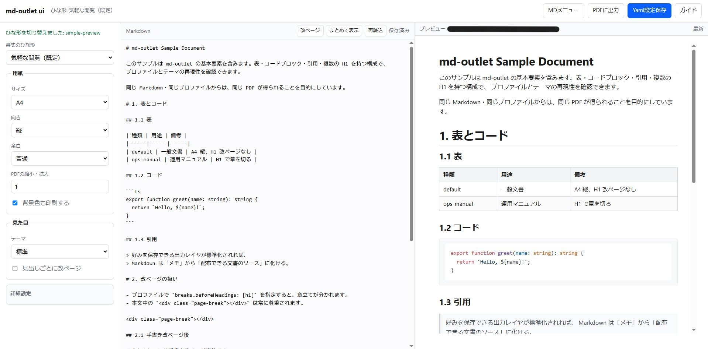
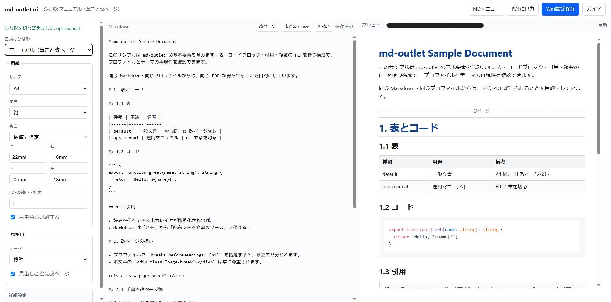

# md-outlet

*Preferences for Markdown output — same source, your paper.*



*左: 紙面設定　中央: Markdown　右: プレビュー（PDF と同じ HTML）*

プレビューと PDF で見た目がズレる——Markdown あるあるです。  
md-outlet は **同じ HTML パイプライン** で両方を揃え、紙面の好みは版管理できる `profile.yaml` に残します。

**推奨環境:** Windows + 最新 Microsoft Edge（安定版）+ Node 18 LTS  
**ダウンロード（Windows 向け zip）:** [Releases](https://github.com/ApostolusNET/md-outlet/releases)  
**スタートガイド:** [docs/START.md](docs/START.md) · **サンプル:** [examples/sample.md](examples/sample.md)

| 気軽な閲覧（既定） | マニュアル（章ごと改ページ） |
|:---:|:---:|
|  |  |

*ひな形を切り替えるだけで、余白や見出し改ページの紙面が変わります。*

---

## はじめ方

```bash
cd md-outlet
npm install
npx md-outlet ui          # 引数なし → スタートガイドが開く
```

- **Windows:** `start-ui.bat` をダブルクリックでも同じ  
- **macOS / Linux:** `./start-ui.sh`（初回だけ `chmod +x start-ui.sh`）

```bash
# 特定の Markdown を開く
npx md-outlet ui path/to/notes.md

# CLI で PDF（任意）
npx md-outlet pdf examples/sample.md --profile default -o examples/sample.pdf
```

Windows でエクスプローラーから開く場合は、設置フォルダで **`install-sendto.bat`** を一度実行（送る → md-outlet）。  
フォルダを移動・改名したら再実行してください。起動中なら既存 UI にタブ追加されます（最大 3）。

Linux は Docker（Chromium）で CLI／PDF／テスト確認済み。macOS は未確認。

| 文書 | 内容 |
|------|------|
| [SPEC.md](SPEC.md) | 仕様 |
| [schemas/profile-v1.json](schemas/profile-v1.json) | プロファイルスキーマ |
| [LICENSE](LICENSE) | MIT（Copyright © 2026 I.C.A. Co., Ltd.） |

---

## コマンド

| コマンド | 用途 |
|----------|------|
| `md-outlet pdf <input.md>` | PDF 出力（既定は入力と同じ場所） |
| `md-outlet html <input.md>` | 中間 HTML（プレビューと同じ） |
| `md-outlet preview <input.md>` | ローカルでライブプレビュー |
| `md-outlet ui [input.md]` | 設定 UI（推奨入口） |
| `md-outlet init <name>` | プロファイル雛形を生成 |

よく使うフラグ:

- `--profile, -p <名前|パス>` … 組み込み名（`default` / `ops-manual` / `simple-preview`）または YAML/JSON パス
- `--output, -o <path>` … 出力先
- `--port <n>` … プレビュー用ポート（既定 5757）

一時上書き（プロファイルファイルは変えない）:

- `--format A4|A3|Letter|Legal`
- `--orientation portrait|landscape`
- `--margin 15mm`（または `--margin-top` など）
- `--scale 0.9`（PDF のみ、0.1〜2.0）

ブロックをできるだけ同一ページに残す:

```html
<div class="keep-together">
...content...
</div>
```

### Front matter（文書ごとの設定）

Markdown 先頭に書けます。単発なら別プロファイル不要です。

```markdown
---
md-outlet:
  extends: ops-manual
  page:
    orientation: landscape
    margin: { top: 15mm, right: 15mm, bottom: 15mm, left: 15mm }
---

# タイトル
```

解決順: **ベースプロファイル → front matter → CLI 上書き**。  
`--profile` を明示すると `extends` より優先されます。

```bash
npx md-outlet pdf examples/sample-frontmatter.md -o examples/sample-frontmatter.pdf
```

### プロファイル初期化

```bash
npx md-outlet init my-report
npx md-outlet init my-report --based-on ops-manual -o ./my-report.yaml
npx md-outlet init --list
npx md-outlet pdf doc.md --profile ./my-report.yaml
```

既存ファイルは `--force` なしでは上書きしません。

### 設定 UI

```bash
npx md-outlet ui
npx md-outlet ui path/to/README.md
npx md-outlet ui examples/sample.md --profile default -o ./my-report.yaml
npx md-outlet ui --no-open   # ブラウザを開かない（CI など）
```

既定で `http://127.0.0.1:5760/` を開きます。既に UI が動いていれば、2 つ目の起動／「送る」は **既存へタブ追加**（最大 3。4 つ目は拒否）。

画面の見方:

- **左** … 用紙・テーマ・H1 改ページなど → **Yaml設定保存**
- **中央** … **MDメニュー → 編集** で Markdown エディター
- **右** … ライブプレビュー（PDF と同じ HTML）。データ文書はスキャン表示
- **ヘッダー** … MDメニュー（新規／開く／編集／保存／閉じる）、PDFに出力、Yaml設定保存、ガイド

組み込みの `profiles/` は上書きしません（`-o` で別ファイルへ）。  
UI はバンドラなし（`ui/index.html` + `ui/styles.css` + `ui/js/*.js`）。

---

## プロファイル

出力を 1 ファイル（`.yaml` / `.yml` / `.json`）で表します。項目一覧は [SPEC.md](SPEC.md)。

```yaml
version: 1
meta:
  name: my-profile
page:
  format: A4
  margin: { top: 20mm, right: 18mm, bottom: 20mm, left: 18mm }
theme: default
breaks:
  beforeHeadings: [h1]
  skipFirst: true
```

組み込み:

- `simple-preview` … 気軽な閲覧（UI 既定。H1 強制改ページなし）
- `default` … 一般文書
- `ops-manual` … 運用マニュアル向け（表紙＋ H1 ごと章立て）

### 改ページ

次を併用できます。二重改ページで白紙ページは出さない実装です。

- Markdown 内: `<div class="page-break"></div>`
- プロファイル: `breaks.beforeHeadings: [h1]`（先頭 H1 は `skipFirst` でスキップ可）

見出し直前に手書き改ページがある場合、自動注入は省略されます。

---

## テーマ

`themes/<name>/theme.css` に置きます。同梱 `default` は表罫線・コード背景など、ブラウザ印刷で落ちやすい要素を補います。

プロファイルからの相対パスも可:

```yaml
theme: ./themes/paper/theme.css
```

---

## 設計の約束

実装で守る前提です（詳細は SPEC）。

1. プレビューと PDF は同じ生成 HTML を使う  
2. `theme: default` で表罫線・コード背景を失わない  
3. `breaks.beforeHeadings` は Chromium PDF 向けに実要素を注入する  
4. 描画前に `schemas/profile-v1.json` で検証する  

---

## 開発

```bash
npm install
npm run test:schema   # 同梱プロファイル検証
npm run smoke         # サンプル PDF
npm test              # 一式
npm run cli -- pdf examples/sample.md
```
